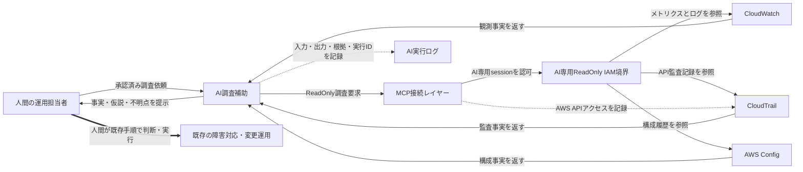

# ReadOnly AI調査補助アーキテクチャ

## 導入スコープ

| Scope ID | 宣言 |
| --- | --- |
| SC-01 | IN: AIは承認済みAWS情報源をReadOnlyで調査する |
| SC-02 | IN: AIは根拠付きの整理と報告下書きを作る |
| SC-03 | OUT: AIは変更・release・IAM変更・削除・自動復旧を実行しない |
| SC-04 | OUT: AIは本番判断や例外承認を確定しない |
| SC-05 | KEEP: 既存の障害対応・承認・変更・release手順を維持する |
| SC-06 | KEEP: 人間が最終判断と既存運用上の実行を担う |

## 構成要素

| Node ID | 名称 | 境界と責任 |
| --- | --- | --- |
| HUMAN | 人間の運用担当者 | 事実・仮説・不明点を確認し、最終判断と既存手順上の実行を担う |
| AI | AI調査補助 | ReadOnly調査と根拠付き整理だけを行い、変更や最終判断を行わない |
| MCP | MCP接続レイヤー | AIの調査要求をAWS APIへ中継し、接続手段自体を権限保証とみなさない |
| IAM | AI専用ReadOnly IAM境界 | AI専用sessionへ承認済み参照操作だけを許可する主制御 |
| CW | CloudWatch | メトリクスとログの観測事実を提供する |
| CT | CloudTrail | API監査記録を情報源として提供し、MCP経由のAWS APIアクセスも記録する |
| CFG | AWS Config | リソース構成と変更履歴の観測事実を提供する |
| AILOG | AI実行ログ | AIの入力・出力・根拠・実行IDを記録する |
| OPS | 既存の障害対応・変更運用 | 既存の承認、障害対応、変更、release手順をそのまま維持する |

## データフロー

| Flow ID | From | To | Kind | Label |
| --- | --- | --- | --- | --- |
| F01 | HUMAN | AI | request | 承認済み調査依頼 |
| F02 | AI | MCP | readonly_query | ReadOnly調査要求 |
| F03 | MCP | IAM | authorize | AI専用sessionを認可 |
| F04 | IAM | CW | readonly_query | メトリクスとログを参照 |
| F05 | IAM | CT | readonly_query | API監査記録を参照 |
| F06 | IAM | CFG | readonly_query | 構成履歴を参照 |
| F07 | CW | AI | evidence | 観測事実を返す |
| F08 | CT | AI | evidence | 監査事実を返す |
| F09 | CFG | AI | evidence | 構成事実を返す |
| F10 | MCP | CT | audit | AWS APIアクセスを記録 |
| F11 | AI | AILOG | audit | 入力・出力・根拠・実行IDを記録 |
| F12 | AI | HUMAN | recommendation | 事実・仮説・不明点を提示 |
| F13 | HUMAN | OPS | human_decision | 人間が既存手順で判断・実行 |

## 図

## 判断と非置換の説明

- 人間判断: AIは事実・仮説・不明点を分けて提示した時点で止まり、本番影響、例外、変更、復旧方針は人間へ渡す。
- 既存運用: AIからOPSへの直接フローを作らず、人間だけが既存の承認・障害対応・変更・release手順へ接続するため、調査補助レイヤーは既存運用を置き換えない。
- 監査: CloudTrailはAWS APIアクセスのidentity・event・parameters・errorを追跡し、AI実行ログはAIへの入力・出力・根拠・実行IDを追跡する。片方をもう片方の代用にしない。

## 設計記録

- 作成者role: SRE設計担当
- 作成日: 2026-07-15
- 使用fixture: `fixtures/architecture-requirements.json`
- レビュー状態: 未確認

